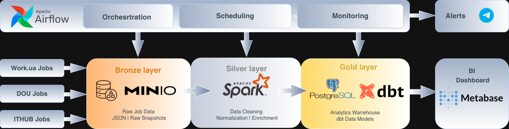
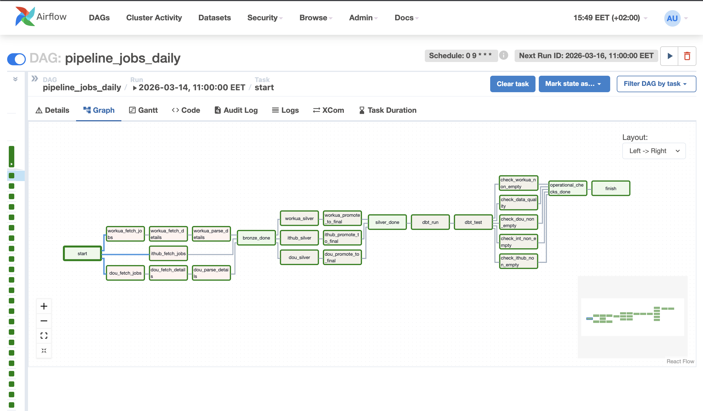
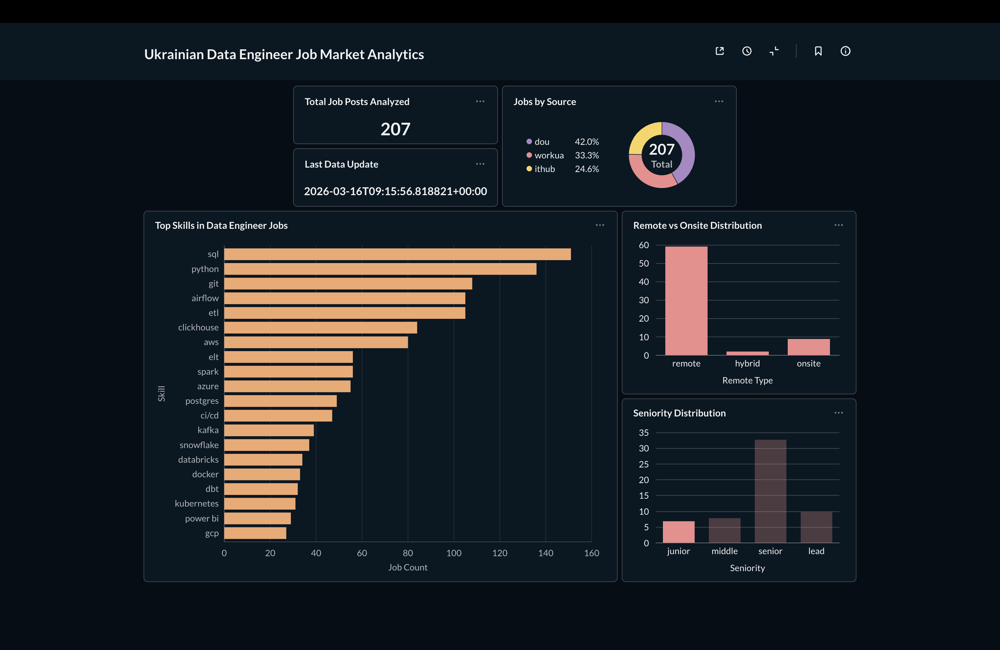

# Ukrainian Data Engineer Job Market Pipeline


End-to-end **Data Engineering pipeline** that collects, processes and analyzes Data Engineer job postings from Ukrainian job platforms.

The project demonstrates a production-like architecture including orchestration, distributed processing, data quality checks, and analytical dashboards.

---

# Architecture



---

# Data Sources

The pipeline collects job postings from multiple platforms:

• DOU  
• Work.ua  
• ITHub  

Each source is parsed independently and merged into a unified dataset.

Data Engineer related job postings are collected using keyword-based scraping.

---

# Orchestration (Airflow DAG)

The pipeline is orchestrated using **Apache Airflow**.

The DAG coordinates ingestion, transformations, data quality checks, and analytical modeling.



The pipeline includes:

• parallel ingestion from multiple sources  
• Spark transformations  
• Postgres loading  
• dbt modeling  
• operational data quality checks  
• Telegram alerting on failures

---

# Tech Stack

| Layer | Technology |
|-----|------|
| Orchestration | Airflow |
| Processing | PySpark |
| Data Lake | MinIO |
| Warehouse | Postgres |
| Transformations | dbt |
| Dashboard | Metabase |
| Monitoring | Telegram Alerts |
| Infrastructure | Docker |

---

# Project Structure
```text
job-market-data-platform
│
├── airflow
│   ├── dags
│   ├── lib
│   └── Dockerfile
│
├── spark
│   ├── jobs
│   └── Dockerfile
│
├── dbt
│   ├── models
│   ├── dbt_project.yml
│   └── profiles.yml
│
├── data
│   ├── bronze
│   ├── silver
│   └── source
│
├── docker-compose.yml
└── README.md 
```
---

# Pipeline Flow

## 1️⃣ Data Ingestion

Airflow DAG executes daily and fetches job postings from multiple sources.

Tasks include:
```
fetch jobs
fetch detail pages
parse job descriptions
```
Each source pipeline runs independently and produces raw datasets.

---

## 2️⃣ Bronze Layer

Raw scraped data is stored in **MinIO**.

Purpose:
```
• store raw snapshots  
• enable reprocessing  
• debugging and lineage
```
---

## 3️⃣ Silver Layer

Spark performs distributed transformations:
```
• text normalization  
• seniority classification  
• remote type detection  
• skill extraction  
```
Cleaned datasets are loaded into **Postgres staging tables**.

---

## 4️⃣ Gold Layer

Postgres acts as the analytical warehouse.

Source tables:
```
workua_jobs_clean
dou_jobs_clean
ithub_jobs_clean
```
These tables contain normalized job postings ready for analytical modeling.

---

## 5️⃣ Analytics Modeling

dbt builds analytical models on top of warehouse tables.

Model layers include:
```
staging
intermediate
marts
```
These models power the analytics dashboard.

---

# Data Quality

The pipeline includes automated validation.

## dbt tests
```
not_null
unique
accepted_values
```
Applied to important columns:
```
source
seniority
remote_type
```
---

## Operational Checks

Additional SQL checks validate pipeline outputs:

• source tables are not empty  
• unified dataset exists  
• classification ratios remain within thresholds

Example rule:
```
unknown_seniority_ratio < 0.8
```
---

# Monitoring

Airflow task failures trigger **Telegram alerts**.

Example notification:
```
❌ Airflow task failed

DAG: pipeline_jobs_daily
Task: workua_fetch_jobs
Run ID: …
```
This allows quick detection of ingestion failures.

---

# Dashboard

Analytics dashboard built in **Metabase**.



The dashboard shows:

• most demanded data engineering skills  
• seniority distribution  
• remote vs onsite jobs  
• job source coverage

---

# How to Run

Requirements:
```
Docker
Docker Compose
```
Start the platform:
```bash
docker compose up -d
```
Access services:
```
Airflow UI → http://localhost:8088
Metabase → http://localhost:3000
MinIO → http://localhost:9001
```
Enable the DAG `pipeline_jobs_daily` inside the Airflow UI.

---

# Future Improvements

Potential extensions:

• salary analysis  
• historical job tracking  
• incremental dbt models  
• additional job sources  
• automated data freshness monitoring

---

